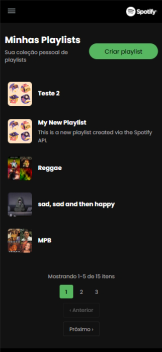

# Luiza Labs - Teste Técnico

Este é um teste técnico da Luiza Labs. Um aplicação web que replica a experiência do Spotify, utilizando a API oficial para autenticação e dados reais. O projeto demonstra proficiência em desenvolvimento frontend moderno, integração de APIs, PWA e boas práticas de desenvolvimento.

**Demo Live: [https://luiza-labs.onrender.com](https://luiza-labs.onrender.com)**


### 🏆 Requisitos Implementados

#### ✅ Obrigatórios
- [x] **Segmentação de commits** - Conventional Commits
- [x] **Lint** - ESLint com regras TypeScript
- [x] **Autenticação via Spotify** - OAuth2 PKCE Flow
- [x] **Listar artistas** - Top artists do usuário
- [x] **Listar álbuns de um artista** - Navegação detalhada
- [x] **Paginação** - Componente genérico reutilizável
- [x] **Funcionamento offline** - Service Worker + Cache
- [x] **Testes unitários** - Vitest com coverage
- [x] **Deploy da aplicação** - Render.com

#### 🌟 Bônus
- [ ] **Testes E2E** - Playwright (planejado)
- [x] **Integração com Sentry** - Monitoramento de erros
- [x] **CI/CD** - Github Actions + Docker
- [x] **Responsividade** - Responsividade para mobile e tablet
- [x] **Qualidade de código** - SonarQube
- [x] **PWA** - Progressive Web App com Vite Plugin PWA


## 🛠️ Tecnologias

### Frontend Core
- **React 19.1.1** - Framework principal
- **TypeScript** - Tipagem estática
- **Vite 7.1.9** - Build tool e dev server
- **React Router DOM** - Roteamento SPA

### Styling & UI
- **CSS3** - Estilização
- **Responsive Design** - Para mobile e tablet
- **Spotify Design System** - Interface semelhante

### PWA & Performance
- **Vite Plugin PWA** - Service worker e manifest
- **Workbox** - Cache strategies

### Development & Quality
- **Vitest** - Testing framework
- **V8 Coverage** - Code coverage
- **ESLint** - Code linting
- **SonarQube** - Code quality analysis

### DevOps & Deploy
- **Docker** - Containerização
- **Render.com** - Cloud deployment
- **Sentry** - Error monitoring


## 🚀 Como Executar

### Pré-requisitos
- **Node.js** (≥ 22.0.0)
- **npm**
- **Conta Spotify Developer** para API keys

### Configuração da API Spotify

1. **Acesse** [Spotify for Developers](https://developer.spotify.com/)
2. **Crie um app** e anote o `Client ID`
3. **Configure Redirect URI**: `http://localhost:8080/callback`

### Execução Local

```bash
# 1. Clone o repositório
git clone https://github.com/vieiraeduardos/luiza-labs.git
cd luiza-labs

# 2. Instale as dependências
npm install

# 3. Configure as variáveis de ambiente
cp .env.example .env
# Edite o .env com suas credenciais:
# VITE_SPOTIFY_CLIENT_ID=seu_client_id_aqui
# VITE_REDIRECT_URI=http://localhost:8080/callback

# 4. Execute em modo desenvolvimento
npm run dev

# 5. Acesse http://localhost:8080
```

### Execução com Docker

```bash
# 1. Clone o repositório
git clone https://github.com/vieiraeduardos/luiza-labs.git
cd luiza-labs

# 2. Configure o compose.yaml
# Edite as variáveis de ambiente no arquivo

# 3. Build e execute
docker build -t luiza-labs .
docker compose up -d

# 4. Acesse http://localhost:8080
```

## 🧪 Testes

```bash
# Executar testes
npm test

# Coverage completo
npm run coverage

# Relatório HTML em /coverage
```


## 🎨 Screenshots

### Desktop e PWA


### Mobile



## 📝 Observações e Pontos de Melhoria

### 🔹 Separação entre Frontend e Backend
Atualmente, o **frontend** e o **backend** estão integrados na mesma aplicação Vite.  
Separar essas camadas traria ganhos significativos de **segurança** e **escalabilidade**:

- O **frontend** não precisaria mais armazenar **tokens sensíveis** no `localStorage` nem enviá-los diretamente nas requisições à **API do Spotify**.  
- O **backend** poderia gerenciar um **token de sessão próprio**, usado para intermediar as chamadas à API externa, evitando a exposição de credenciais.  
- Essa separação também permitiria **escalar** cada módulo de forma independente, otimizando recursos e facilitando a manutenção do sistema.

### 🔹 CI/CD
Atualmente, a aplicação é implantada automaticamente por meio da **Render**, simplificando o processo de deploy.  
Com o uso do **Dockerfile**, é possível criar **pipelines personalizados** em ferramentas como **GitHub Actions** ou **Jenkins**, permitindo maior controle e flexibilidade no processo de integração e entrega contínua.


## 👨‍💻 Autor

**Eduardo Silva Vieira**
- 🐙 GitHub: [@vieiraeduardos](https://github.com/vieiraeduardos)
- 💼 LinkedIn: [@vieiraeduardos](https://linkedin.com/in/vieiraeduardos)
- 📧 Email: jobs.eduardovieira@gmail.com
